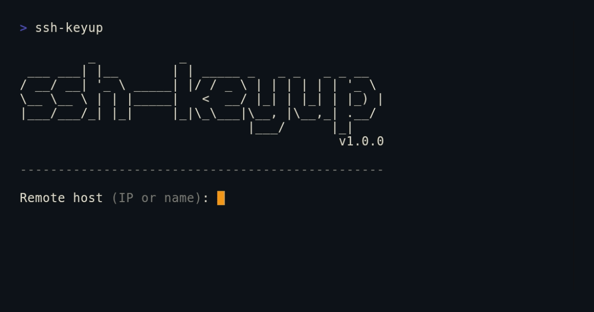

# ssh-keyup


Set up passwordless SSH on Raspberry Pi, NVIDIA Jetson, or any Linux device — in one command.

Tired of juggling `ssh-keygen`, `ssh-copy-id` (missing on Windows), and `~/.ssh/config` edits every time you set up a new device? `ssh-keyup` handles all three in a single interactive session.



## Quickstart

Install globally with pip:

```bash
pip install git+https://github.com/Kurokesu/ssh-keyup.git

ssh-keyup   # ready to use anywhere
```

Or run directly without installing:

```bash
git clone https://github.com/Kurokesu/ssh-keyup.git
cd ssh-keyup
python ssh_keyup.py   # Windows
python3 ssh_keyup.py  # Linux
```

Follow the prompts, enter the remote password once, and you're done:

```bash
ssh mypi   # no password, ever again
```

Or open [VSCode Remote - SSH](https://marketplace.visualstudio.com/items?itemName=ms-vscode-remote.remote-ssh) — your `~/.ssh/config` is already set up. Hit `Ctrl+Shift+P`, select **Remote-SSH: Connect to Host**, pick your alias, and get a full IDE on your remote device — no password:


You can also skip the prompts entirely:

```bash
ssh-keyup --host 192.168.1.23 --user pi --alias mypi
```

Or configure a whole fleet:

```bash
for host in 192.168.1.10 192.168.1.11 192.168.1.12; do
  ssh-keyup --host $host
done
```

## Why?

```bash
# without ssh-keyup (you do this for every new device)
ssh-keygen -t ed25519 -N "" -f ~/.ssh/id_ed25519_rpi5
scp ~/.ssh/id_ed25519_rpi5.pub trinity@192.168.1.23:~/
ssh trinity@192.168.1.23 "mkdir -p ~/.ssh && chmod 700 ~/.ssh"
ssh trinity@192.168.1.23 "cat ~/id_ed25519_rpi5.pub >> ~/.ssh/authorized_keys && chmod 600 ~/.ssh/authorized_keys && rm ~/id_ed25519_rpi5.pub"
nano ~/.ssh/config # add Host entry manually
...

# with ssh-keyup
ssh-keyup
```

## Prerequisites

**Python 3.8+** and OpenSSH tools (`ssh`, `ssh-keygen`) must be in PATH.

- **Windows 10/11**: Install Python from [python.org](https://www.python.org/downloads/) or the Microsoft Store. OpenSSH Client is included via Settings > Optional Features, or ships with [Git for Windows](https://gitforwindows.org).
- **Linux**: `sudo apt install python3 openssh-client` (usually pre-installed).

## Features

- Generates a per-host **Ed25519** key pair (`~/.ssh/id_ed25519_<alias>`)
- Deploys the public key in a **single SSH session** — only one password prompt
- Adds a named entry to `~/.ssh/config` — works instantly with `ssh <alias>` and VSCode Remote SSH
- Detects and recovers from **host key mismatches** (common after reflashing)
- Safe to re-run: existing keys are reused or regenerated, duplicate config entries are detected
- Works with any device you can reach over SSH: Raspberry Pi, NVIDIA Jetson, Orange Pi, VMs, servers
- **Zero dependencies** — Python 3.8+ standard library only
- Installable via `pip` or runnable as a single script
