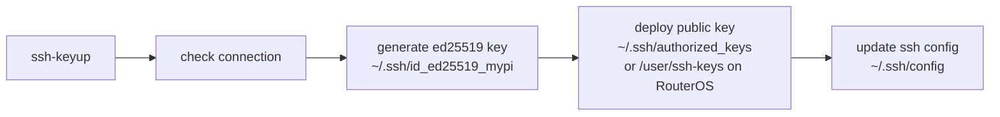

# ssh-keyup


**Set up passwordless SSH in one command on any Linux or RouterOS device, such as Raspberry Pi, NVIDIA Jetson or MikroTik routers.**

Tired of juggling `ssh-keygen`, `ssh-copy-id` (missing on Windows) and `~/.ssh/config` edits every time you set up a new device?

**`ssh-keyup`** handles all three in one interactive session.


## Quickstart

Install globally with pip:

```bash
pip install ssh-keyup

ssh-keyup   # ready to use anywhere
```

> **Tip:** If `ssh-keyup` is missing or runs an old version after install, new script sits in a folder outside PATH (pip warns about this). Add that folder to PATH, or install with [pipx](https://pipx.pypa.io/) instead:
>
> `pipx install ssh-keyup`

Or run directly without installing:

```bash
git clone https://github.com/Kurokesu/ssh-keyup.git
cd ssh-keyup
python ssh_keyup.py   # Windows
python3 ssh_keyup.py  # Linux
```

Follow prompts, enter remote password once and you're done. Alias now works in anything that reads `~/.ssh/config`:

**Terminal:**

```bash
ssh mypi   # no password, ever again
```

**VSCode:** [Remote - SSH](https://marketplace.visualstudio.com/items?itemName=ms-vscode-remote.remote-ssh) works out of the box. Press `Ctrl+Shift+P`, select **Remote-SSH: Connect to Host** and pick your alias for a full IDE on the device, no password:


## Usage

### Skip prompts

```bash
ssh-keyup pi@192.168.1.23 mypi        # user, host and alias in one go
ssh-keyup pi@192.168.1.23:2222 mypi   # non-default SSH port
ssh-keyup admin@192.168.88.1 router   # RouterOS, detected automatically
```

Flags (`--host`, `--user`, `--alias`, `--port`, `--os`) work too, see `ssh-keyup --help`

### Set up a fleet

```bash
for host in 192.168.1.10 192.168.1.11 192.168.1.12; do
  ssh-keyup pi@$host
done
```

### Manage entries

List or remove entries ssh-keyup manages:

```bash
ssh-keyup --list
ssh-keyup --remove mypi   # deletes its key pair too
```

## Prerequisites

**Python 3.8+** and OpenSSH tools (`ssh`, `ssh-keygen`) in PATH.

- **Windows 10/11**: Python from [python.org](https://www.python.org/downloads/) or Microsoft Store. OpenSSH Client via Settings > Optional Features or [Git for Windows](https://gitforwindows.org).
- **Linux**: `sudo apt install python3 openssh-client` (usually pre-installed).

## How it works


```mermaid
flowchart LR
    run["ssh-keyup"] --> check["check connection"]
    check --> gen["generate ed25519 key<br/>~/.ssh/id_ed25519_mypi"]
    gen --> deploy["deploy public key<br/>~/.ssh/authorized_keys<br/>or /user/ssh-keys on RouterOS"]
    deploy --> config["update ssh config<br/>~/.ssh/config"]
```

## Features

- Works on **Windows OpenSSH**, where `ssh-copy-id` does not exist
- **Never touches your password**. Only the public key is piped over SSH and OpenSSH prompts for the password itself
- One **Ed25519** key per device (`~/.ssh/id_ed25519_<alias>`), not one key reused everywhere
- Deploys in a **single SSH session**, one password prompt total
- Adds a named entry to `~/.ssh/config`, works instantly with `ssh <alias>` and VSCode Remote SSH
- Checks host is **reachable** first, so typos surface before keys exist
- Detects **RouterOS** and imports the key its way
- Recovers from **host key mismatches** after a reflash
- **Entry management**, list or retire devices without leaving stale keys behind
- **Zero dependencies**, standard library plus system OpenSSH

## FAQ

### Why not do it by hand?

Usual commands for passwordless SSH from Windows:

```powershell
ssh-keygen -t ed25519
type $env:USERPROFILE\.ssh\id_ed25519.pub | ssh pi@raspberrypi.local "cat >> ~/.ssh/authorized_keys"
notepad $env:USERPROFILE\.ssh\config   # then add a Host block by hand
```

Works once. Same key lands on every device, `~/.ssh` keeps default permissions that sshd may reject and each new device means another config edit.

### Why not ssh-copy-id?

`ssh-copy-id` appends a key to `authorized_keys` and stops there. Windows OpenSSH does not ship it at all and RouterOS has no `authorized_keys` to append to.

|  | ssh-keyup | ssh-copy-id |
|---|:---:|:---:|
| Works on Windows OpenSSH | yes | no |
| Works with RouterOS | yes | no |
| Ed25519 key per device | yes | no |
| Sets `authorized_keys` permissions | yes | yes |
| Writes `~/.ssh/config` alias | yes | no |
| Recovers from changed host key | yes | no |
| Entry management | yes | no |

### How do I fix "REMOTE HOST IDENTIFICATION HAS CHANGED"?

Reflashing creates a new host key, so next `ssh` refuses to connect:

```text
@@@@@@@@@@@@@@@@@@@@@@@@@@@@@@@@@@@@@@@@@@@@@@@@@@@@@@@@@@@
@    WARNING: REMOTE HOST IDENTIFICATION HAS CHANGED!     @
@@@@@@@@@@@@@@@@@@@@@@@@@@@@@@@@@@@@@@@@@@@@@@@@@@@@@@@@@@@
IT IS POSSIBLE THAT SOMEONE IS DOING SOMETHING NASTY!
...
Offending ECDSA key in ~/.ssh/known_hosts:3
Host key verification failed.
```

Run `ssh-keyup` again. It detects a changed key, shows new fingerprint for confirmation, clears stale `known_hosts` entry with `ssh-keygen -R` and redeploys. Usually a reflash is behind it, but this warning can also mean a real man-in-the-middle, so `ssh-keyup` asks instead of trusting silently.

### Does `--remove` clean up entries on the device?

No. It deletes local key pair and `~/.ssh/config` entry. Line in the device's `authorized_keys` (or `/user/ssh-keys` entry on RouterOS) stays until removed there.

### What devices are supported?

Any Linux device reachable over SSH: Raspberry Pi, NVIDIA Jetson, Orange Pi, VMs, servers. Any RouterOS 7.12 or newer device, MikroTik routers or CHR alike, is detected from SSH banner and gets its own key import, `--os routeros` forces it.

### How do I add an SSH key to a MikroTik router from Windows?

By hand on RouterOS 7:

```powershell
ssh-keygen -t ed25519
scp $env:USERPROFILE\.ssh\id_ed25519.pub admin@192.168.88.1:
ssh admin@192.168.88.1 "/user/ssh-keys/import public-key-file=id_ed25519.pub user=admin"
```

Works, with two password prompts and the default key shared across devices again. `ssh-keyup admin@192.168.88.1 router` does it in one session with one prompt, RouterOS is detected from SSH banner. Login user needs `policy` permission (`full` group has it) and firmware 7.12 or newer, older RouterOS rejects Ed25519 keys with `unable to load key file (wrong format or bad passphrase)`.

### Why does RouterOS refuse my password over SSH after adding a key?

That is the default: once a user has a key, RouterOS stops accepting that user's password over SSH. WinBox and WebFig are unaffected, and password SSH can be turned back on under `/ip/ssh`.
